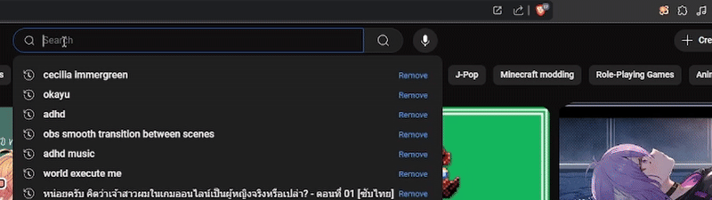

# RomaKana - Chrome Extension  

A simple Chrome extension that converts selected **Romaji** text into **Hiragana, Katakana** then **copies the result to the clipboard**.  

  


---

## 📥 Installation  
1. **Download the source code** or clone this repository:  
   ```bash
   git clone https://github.com/SakanaIsReal/romakana.git